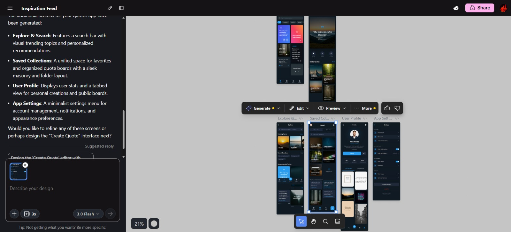
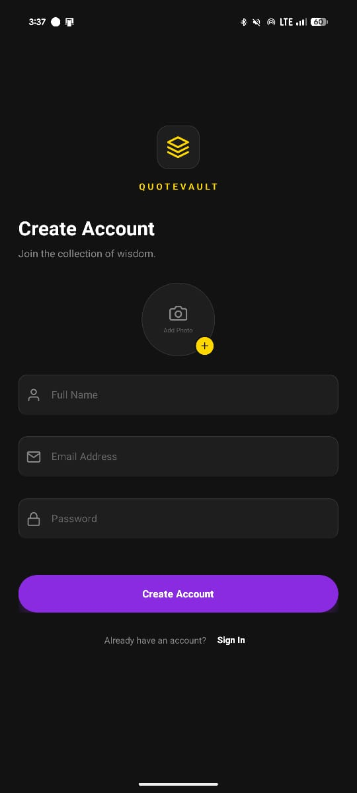
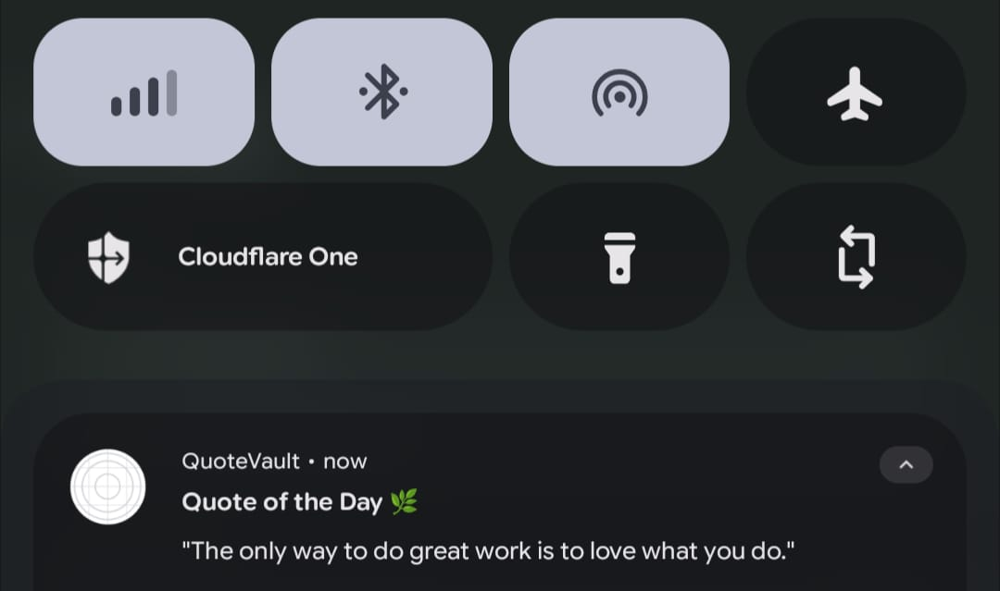

# 🏛️ QuoteVault

> **Daily Wisdom, Beautifully Curated.**
>
> A premium mobile experience for discovering, collecting, and sharing quotes. Built with an AI-First workflow.


## 🤖 AI Power Stack

This project was built using a cutting-edge **AI-Assisted Development** workflow. The following tools were utilized to generate UI, logic, and code:

| Category | Tool Used | Purpose |
| :--- | :--- | :--- |
| **🎨 UI Design** | **Stitch** | Initial UI concept generation, color palettes, and layout inspiration. |
| **💻 Code Generation** | **Google AI Studio** | Complex logic refactoring, bug fixing, and native module implementation. |
| **🧠 Reasoning** | **Claude & Gemini** | Architectural decisions, state management logic, and debugging. |
| **✨ Prompt Engineering** | **Gemini** | Iterative refinement of features and structural planning. |

---

The Vision (UI via Stitch)



Demo video: https://www.loom.com/share/81f79b1bd2254b30b1c208a6791c16ec

UI Screenshots that were not in the demo video:



---

## ✨ Key Features

* **📱 Staggered Masonry Feed:** A Pinterest-style scrolling experience for browsing thousands of quotes.
* **🔔 Sticky Daily Notifications:** High-priority, persistent daily notifications that ensure you never miss your morning inspiration.
* **📂 Custom Collections:** Create named "Vaults" (e.g., Gym, Work, Love) to save and organize quotes.
* **🔍 Deep Search:** Instantly find quotes by author, content, or category.
* **🎨 Dynamic Theming:** Switch between **Dark Mode**, **Light Mode**, and the signature **Gold Theme**.
* **⚡ Supabase Backend:** Real-time data fetching and secure user authentication.

---

## 🛠️ Technical Stack

* **Framework:** [React Native](https://reactnative.dev/) (via [Expo](https://expo.dev/))
* **Language:** TypeScript
* **Backend:** Supabase (PostgreSQL & Auth)
* **Navigation:** Custom State-Based Router (for performance) & Deep Linking
* **UI Components:** React Native Elements, Expo Linear Gradient
* **Storage:** Async Storage (Local caching for offline access)

---

## 🚀 Getting Started

Follow these steps to run the project locally.

### Prerequisites
* Node.js & npm installed
* Android Studio (for Android Emulator) OR a physical Android device
* Expo CLI (`npm install -g eas-cli`)

### Installation

1.  **Clone the repository:**
    ```bash
    git clone [https://github.com/flarrow27/QuoteVault.git](https://github.com/flarrow27/QuoteVault.git)
    cd quotevault
    ```

2.  **Install dependencies:**
    ```bash
    npm install
    ```

3.  **Setup Environment:**
    Create a `.env` file in the root directory and add your Supabase keys:
    ```env
    EXPO_PUBLIC_SUPABASE_URL=your_supabase_url
    EXPO_PUBLIC_SUPABASE_ANON_KEY=your_supabase_anon_key
    ```

4.  **Run the App:**
    ```bash
    # For Android (Physical Device or Emulator)
    npx expo run:android --device
    ```

---

## 🔄 Development Workflow

The development of QuoteVault followed a strict **Prompt-Driven Development (PDD)** cycle:

1.  **Ideation:** Feature requests were defined using natural language prompts in **Gemini**.
2.  **Visualization:** **Stitch** was used to visualize the UI components (cards, headers, masonry grids).
3.  **Implementation:** Code was generated via **AI Studio** and **Claude**, pasting strictly typed TypeScript components directly into the codebase.
4.  **Refinement:** Iterative debugging was done by feeding error logs back into the AI context for immediate resolution.

---

## 📄 License

This project is licensed under the MIT License - see the [LICENSE](LICENSE) file for details.

---

Note: Every requirement in the assignment except the widget part is complete. Please look into it.

*Built with ❤️ and 🤖 by Jabin.*
